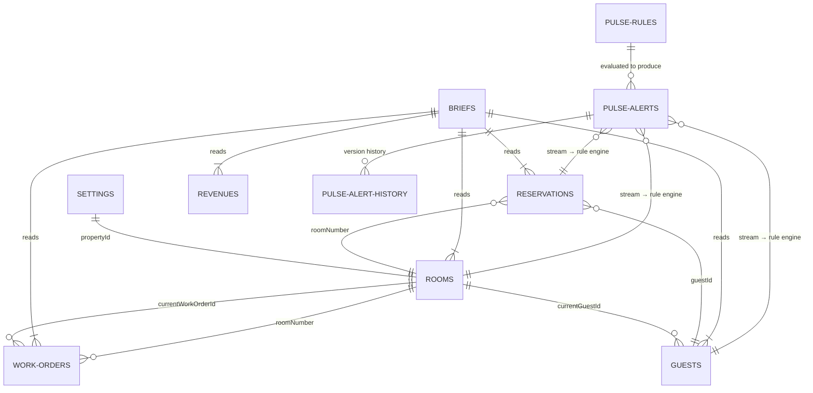

# StayOS — Data Model Reference

The canonical DynamoDB data-model reference for the whole StayOS platform. Two
layers on a single shared data foundation:

- **LUMI operational + application layer (7 `stayos-*` tables)** — 5 read-only
  dataset tables seeded once with ~24,000 items (30 days of deterministic hotel
  operations data across 5 pilot properties) plus 2 LUMI application tables. The
  5 dataset tables stream changes (`NEW_AND_OLD_IMAGES`).
- **PULSE feature layer (5 `pulse-*` tables)** — PULSE owns these; it never
  writes to the LUMI tables. PULSE's rule engine consumes the 5 dataset-table
  streams to produce alerts, and the Action Executor's closed-loop write-back
  targets the LUMI operational tables (the only place PULSE writes to them,
  gated by GM approval).

Everything is partitioned by `propertyId` (the data-isolation boundary between
properties) except `stayos-settings` (by `gmAlias`), `pulse-alerts` /
`pulse-alert-history` (by `alertId`), and `pulse-push-subscriptions` (by
`gmAlias`).

---

## Table Summary

### LUMI layer — operational dataset (read-only) + application tables

| Table | PK | SK | GSI | Items | Access |
|-------|----|----|-----|-------|--------|
| **stayos-rooms** | propertyId | roomNumber | propertyId-statusRoomNumber-index | 2,008 | read-only dataset (stream on) |
| **stayos-guests** | propertyId | guestId | propertyId-loyaltyTierGuestId-index | 250 | read-only dataset (stream on) |
| **stayos-reservations** | propertyId | dateReservationId | propertyId-arrivalDate-index | 21,510 | read-only dataset (stream on) |
| **stayos-revenues** | propertyId | date | — | 150 | read-only dataset (stream on) |
| **stayos-work-orders** | propertyId | workOrderId | propertyId-statusCreatedAt-index | 775 | read-only dataset (stream on) |
| **stayos-briefs** | propertyId | briefDate | — | 58 | LUMI read/write |
| **stayos-settings** | gmAlias | — | — | 5 | LUMI read/write |

The 5 dataset tables are seeded once and are read-only at runtime
(`Query`/`GetItem`); their DynamoDB Streams (`NEW_AND_OLD_IMAGES`) are what
PULSE evaluates. The only runtime writes back to them come from PULSE's
GM-approved closed-loop Action Executor.

### PULSE layer — alerting tables (PULSE-owned)

| Table | PK | SK | GSI | Purpose |
|-------|----|----|-----|---------|
| **pulse-alerts** | alertId | — | propertyId-status-index · propertyId-createdAt-index · gmAlias-status-index · escalationStatus-escalationNextCheckAt-index | Live alerts + attached `triageBrief`, approval, escalation state. Stream on (`NEW_AND_OLD_IMAGES`) for history/escalation consumers. |
| **pulse-rules** | propertyId | ruleType | — | Per-property enabled rule set the rule engine evaluates (seeded: 6 alert types × 5 properties). |
| **pulse-alert-history** | alertId | version | propertyId-createdAt-index | Append-only status-change/version history (TTL `expiresAt`). |
| **pulse-push-subscriptions** | gmAlias | endpointHash | — | Web Push (VAPID) device subscriptions per GM. |
| **pulse-kitchen** | propertyId | — | — | One Kitchen/F&B snapshot per property (banquet countdown, F&B stats, delivery SLA, orders, channel mix) for the Kitchen tab. |

See [`pulse/README.md`](../../pulse/README.md) and the PULSE spec
(`pulse/.kiro/specs/initial-pulse-project/`) for the full attribute-level shapes
of the alert / triageBrief / rule records.

---

## Data Relationships

The LUMI dataset relationships, plus how PULSE consumes them (stream-driven) and
writes back only via the GM-approved closed loop:

PULSE's rule engine reads the 5 dataset-table streams to create `pulse-alerts`;
the GM-approved Action Executor writes a resolving change *back* to the
operational tables (e.g. `stayos-reservations`/`stayos-rooms`), which re-enters
through the stream and resolves the originating alert.

---

## Read Access Patterns

Three separate Lambda-adjacent compute paths read these tables, each with a narrower, read-only IAM policy scoped to only the operations/tables they need:

| Caller | Tables Read | Operations | Access Path |
|--------|------------|------------|--------------|
| **Orchestrator Lambda** (LUMI) | reservations, rooms, guests, revenues, work-orders | Query (by GSI), GetItem | Direct, in-process (`data_puller.py`), writes the resulting brief to `stayos-briefs` |
| **Voice Agent** (AgentCore Runtime, LUMI) | reservations, rooms, guests, revenues, work-orders, briefs | GetItem, Query (by GSI) | Direct, in-process (`tool_handlers.py`) — no Lambda/Gateway hop, for lowest latency during a live audio session |
| **Tool Lambda** `stayos-tools` (AgentCore Gateway target, shared) | reservations, rooms, guests, revenues, work-orders, briefs | GetItem, Query (by GSI) | Invoked by the AgentCore Gateway on behalf of the **LUMI chat agent** and the **PULSE triage/ops-read** consumers via MCP; implements the shared read-only tools (`lumi/backend/functions/tools/lambda_function.py`) |
| **PULSE Rule Engine** (`pulse-rule-evaluator`) | reservations, rooms, guests, revenues, work-orders (via **Streams**), pulse-rules | Stream event source mapping; Query `pulse-rules` | Consumes `NEW_AND_OLD_IMAGES` stream records; evaluates per-property rules; writes `pulse-alerts` |
| **PULSE Action Executor** (`pulse-action-executor`) | reservations, rooms (write-back), pulse-alerts | `TransactWriteItems` (write) | The **only** runtime writer to LUMI operational tables — a GM-approved closed-loop mutation that clears the condition and resolves the originating alert atomically |
| **PULSE ops-read facade** (`pulse-ops-read`) | reservations, rooms, guests, work-orders (via Gateway tools) | via shared Gateway MCP | Backs the VIPs/Ops tabs; reads through the shared Gateway, never direct |

All read paths scope every query/GetItem to a single `propertyId` (the DynamoDB
partition key on every dataset table), which is the actual data-isolation
boundary between properties — not an application-level filter. The chat/triage
agents inject `propertyId` into every tool call automatically; the Tool Lambda
validates `propertyId` is present before executing any query. PULSE property
scoping is additionally enforced server-side from the caller's Cognito claims on
every REST/realtime path.

---

## Pilot Properties

| Property | ID | Rooms | GM | Lang | Business % | Occupancy (wkdy/wknd) | ADR |
|----------|-----|-------|-----|------|-----------|----------------------|-----|
| Aloha Grand Chicago | ALOHA-CHI-001 | 368 | Jennifer Smith (jsmith) | en-US | 75% | 85-92% / 72-80% | $245 |
| Aloha Resort & Spa Miami | ALOHA-MIA-001 | 425 | Miguel Rodriguez (mrodriguez) | en-US | 30% | 75-82% / 85-92% | $278 |
| Aloha Grand Tokyo | ALOHA-TYO-001 | 480 | Takeshi Tanaka (ttanaka) | ja-JP | 80% | 88-96% / 88-94% | $195 |
| Aloha Resort & Spa Madrid | ALOHA-MAD-001 | 380 | Carlos Garcia (cgarcia) | es-ES | 40% | 72-80% / 82-88% | €188 |
| Aloha Resort & Spa Mumbai | ALOHA-BOM-001 | 355 | Priya Desai (pdesai) | en-US | 65% | 80-88% / 78-85% | $138 |

---

<strong>Enumerated Values & Pools</strong> (click to expand)

### Room Types

| Type | Distribution | Floor Range | Rate Multiplier |
|------|-------------|-------------|-----------------|
| KING_STANDARD | 65% | 2–11 | 1.00× |
| KING_DELUXE | 15% | 12–17 | 1.40× |
| QUEEN_DELUXE | 15% | 8–14 | 1.20× |
| SUITE | 3% | 18–22 | 2.50× |
| PENTHOUSE | 2% | 20–24 | 3.50× |

### Loyalty Tiers

| Tier | Count per Property | Stay Range |
|------|--------------------|------------|
| AMBASSADOR | 15 | 25–80 stays |
| TITANIUM | 20 | 10–40 stays |
| PLATINUM | 15 | 5–20 stays |

### Booking Channels

| Channel | Weight | Rate Code |
|---------|--------|-----------|
| DIRECT | 30% | BAR |
| OTA | 25% | BAR |
| CORPORATE | 20% | CORP |
| GROUP | 15% | GROUP |
| LOYALTY | 10% | LOYALTY |

### Work Order Categories

| Issue Type | Default Priority | Resolution (hours) |
|-----------|-----------------|-------------------|
| ELEVATOR | CRITICAL | 6–12 |
| ELECTRICAL | CRITICAL | 6–12 |
| HVAC | HIGH | 12–24 |
| PLUMBING | HIGH | 12–24 |
| HOUSEKEEPING | MEDIUM | 24–48 |
| IT_NETWORK | MEDIUM | 24–48 |
| STRUCTURAL | LOW | 48–72 |

### Guest Preferences (17 values)

| Category | Values |
|----------|--------|
| Floor | HIGH_FLOOR, LOW_FLOOR, QUIET_FLOOR, SPECIFIC_FLOOR |
| Bedding | FEATHER_FREE, HYPOALLERGENIC, EXTRA_PILLOWS, FIRM_MATTRESS |
| Amenities | CHAMPAGNE_ARRIVAL, FRUIT_BASKET, NEWSPAPER_DELIVERY |
| Scheduling | EARLY_CHECK_IN, LATE_CHECKOUT |
| Room | ADJOINING_ROOMS, ALLERGY_FREE_ROOM, OCEAN_VIEW, CITY_VIEW |

### Special Occasions (7 values)

| Occasion | Assignment Rate |
|----------|----------------|
| ANNIVERSARY | ~10% of guests per day (rotated deterministically) |
| BIRTHDAY | |
| HONEYMOON | |
| WEDDING | |
| RETIREMENT | |
| GRADUATION | |
| CORPORATE_RETREAT | |

### Room Views (5 values)

| View | Available At |
|------|-------------|
| LAKE | Chicago |
| CITY | All properties |
| PARK | All properties |
| GARDEN | Miami, Tokyo, Madrid, Mumbai |
| NONE | All properties |

### Corporate Accounts (15)

| # | Account Name |
|---|-------------|
| 1 | Meridian Corp |
| 2 | Atlas Technologies |
| 3 | Horizon Partners |
| 4 | Vanguard Solutions |
| 5 | Sterling & Associates |
| 6 | Pacific Ventures |
| 7 | Nexus Global |
| 8 | Pinnacle Industries |
| 9 | Summit Healthcare |
| 10 | Cascade Financial |
| 11 | Evergreen Consulting |
| 12 | Sapphire Holdings |
| 13 | Citadel Logistics |
| 14 | Monarch Pharmaceuticals |
| 15 | Zenith Aerospace |

---

<strong>Generation Parameters</strong> (click to expand)

| Parameter | Value |
|-----------|-------|
| Seed window | 30 days of history |
| Deterministic | Yes (no randomness — modulo patterns, hash-based rotation) |
| TTL: Reservations | 60 days |
| TTL: Work Orders | 60 days |
| TTL: Revenues | 90 days |
| Batch size | 25 items (DynamoDB BatchWriteItem limit) |
| Retry strategy | 8 retries, exponential backoff 50–5000ms |

### VIP Guest Pool

- 250 total names (50 per property), culturally diverse and matched to property locale
- ~5% assigned sensitive notes (10 templates)
- 12 rotating maintenance staff names

### Stay Length Weights

| Nights | Business-heavy | Leisure-heavy |
|--------|---------------|---------------|
| 1 | 40% | 15% |
| 2 | 30% | 25% |
| 3 | 15% | 30% |
| 4 | 10% | 20% |
| 5 | 5% | 10% |

Blended per property based on `businessWeight` factor.

### Event Calendar

| Property | Events |
|----------|--------|
| Chicago | Midwest Tech Summit (wk2, 95 rooms, 3n) · Meridian Corp Annual (wk3, 82 rooms, 2n) · FinServ Leaders Forum (wk4, 65 rooms, 3n) |
| Miami | Luxury Travel Expo (wk1, 110 rooms, 4n) · Caribbean Wellness Retreat (wk3, 55 rooms, 3n) |
| Tokyo | AP Tech Conference (wk1, 120 rooms, 3n) · Japan Hospitality Forum (wk2, 75 rooms, 2n) · Global Finance Summit (wk4, 90 rooms, 3n) |
| Madrid | EU Luxury Travel Awards (wk2, 60 rooms, 3n) · Madrid Fashion Week Partners (wk4, 45 rooms, 4n) |
| Mumbai | India Startup Summit (wk1, 70 rooms, 3n) · Bollywood Awards Gala (wk3, 95 rooms, 2n) · South Asia Trade Expo (wk4, 50 rooms, 3n) |

---

## Data Volume

**LUMI dataset + application tables** (seeded once, deterministic):

| Table | Items | % of LUMI Total |
|-------|-------|-----------------|
| stayos-reservations | 21,510 | 86.9% |
| stayos-rooms | 2,008 | 8.1% |
| stayos-work-orders | 775 | 3.1% |
| stayos-guests | 250 | 1.0% |
| stayos-revenues | 150 | 0.6% |
| stayos-briefs | 58 | 0.2% |
| stayos-settings | 5 | <0.1% |
| **Total** | **~24,756** | |

**PULSE tables** are runtime/demo-driven (not part of the seeded volume). Their
sizes vary with alert activity; on deploy they hold only seeded rules
(`pulse-rules`: 6 alert types × 5 properties = 30) and per-property kitchen
snapshots (`pulse-kitchen`: 1 per property = 5). `pulse-alerts`,
`pulse-alert-history`, and `pulse-push-subscriptions` grow as alerts fire and
GMs subscribe.
