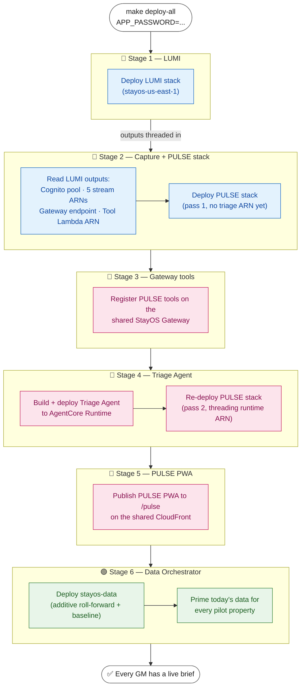

# StayOS — Deployment Pipeline Reference

How the whole StayOS platform gets from `git clone` to a fully populated,
running system with **one command**: `make deploy-all`.

This document explains what that command does, in what order, why the order
matters, and how the pieces are wired together. For the data these stacks read
and write, see [`data-model.md`](data-model.md).

---

## TL;DR

```bash
make deploy-all APP_PASSWORD=YourSecurePassword123!
```

That single command deploys three things in a fixed order — **LUMI → PULSE →
Data Orchestrator** — because each stage produces values the next stage needs.
PULSE can never be deployed standalone from a clean account: it consumes
outputs produced by the LUMI deploy. The final stage primes today's data, so
every GM has a live daily brief the moment the command finishes.

---

## Why a single orchestrated command

StayOS is a multi-feature platform, not one stack:

| Component | Stack prefix | Owns |
|-----------|-------------|------|
| **LUMI** | `stayos` | The shared foundation: Cognito user pool, the 5 read-only operational DynamoDB tables (+ their streams), the shared AgentCore Gateway, the shared Tool Lambda, and the CloudFront distribution served at `/`. |
| **PULSE** | `pulse` | The real-time alerting feature: rule evaluator, Triage Agent (AgentCore Runtime), Action Executor, and the PULSE PWA served at `/pulse`. |
| **Data Orchestrator** | `stayos-data` | The shared, additive roll-forward + PULSE-baseline layer that keeps each property's data current. |

The dependency runs one direction: **PULSE depends on LUMI**, and the **Data
Orchestrator depends on both**. PULSE needs concrete values that only exist
*after* LUMI is deployed:

- the **Cognito user pool** (id, ARN, client id) — for authenticating PULSE users
- the **five operational-table DynamoDB stream ARNs** — the PULSE rule evaluator
  subscribes to these streams to fire alerts
- the **shared AgentCore Gateway endpoint** — PULSE registers its tools here
- the **shared Tool Lambda ARN** — the target PULSE's Gateway tools invoke

Deploying PULSE by hand would mean copying all of those values out of the LUMI
stack outputs and passing them in correctly. `make deploy-all` does exactly that
capture-and-thread step for you, which is why it is the supported path from a
clean account.

---

## The pipeline, stage by stage

`make deploy-all` runs six numbered stages (echoed as `══ [n/6] ══` in the
build log). The flow is a single ordered chain — each stage's output feeds the
next:



### Stage 1 — Deploy LUMI

```
make -C lumi deploy APP_PASSWORD=... AWS_PROFILE=... REGION=...
```

Deploys the LUMI root stack (`stayos-<region>`, e.g. `stayos-us-east-1`) and its
nested stacks — including the `DataStack` that owns the 5 operational tables and
their DynamoDB streams. `APP_PASSWORD` sets the login password for the 5 demo GM
accounts. This is the foundation everything else builds on.

### Stage 2 — Capture LUMI outputs and deploy PULSE (pass 1)

The Makefile reads values back out of the deployed LUMI stack using the
CloudFormation `Outputs[?OutputKey=='X'].OutputValue` query pattern:

- `UserPoolId`, `UserPoolClientId`, `ToolLambdaArn` — from the LUMI **root** stack
- the five `*StreamArn` outputs — from the nested **`DataStack`** (its physical
  name is resolved via its fixed logical id `DataStack`)
- `UserPoolArn` — **not** a stack output, so it is derived deterministically from
  `UserPoolId` + region + account id
- the Gateway endpoint URL — read from SSM parameter
  `/stayos/gateway/endpoint-url`

From each stream ARN the Makefile also derives the table ARN and table name
(string-trimming `/stream/...` and `:table/...`) so PULSE can scope its IAM
policies to exactly those tables. All of these are passed into:

```
make -C pulse deploy USER_POOL_ID=... RESERVATIONS_STREAM_ARN=... (…and the rest)
```

This first PULSE deploy is **pass 1**: the Triage Agent runtime does not exist
yet, so `TRIAGE_RUNTIME_ARN` is passed empty.

### Stage 3 — Register PULSE tools on the shared Gateway

```
make -C pulse gateway-deploy TOOL_LAMBDA_ARN=...
```

Registers PULSE's tools on the shared StayOS AgentCore Gateway, pointing them at
LUMI's shared Tool Lambda.

### Stage 4 — Build the Triage Agent, then re-deploy PULSE (pass 2)

```
make -C pulse triage-deploy
```

Builds and deploys the PULSE Triage Agent to AgentCore Runtime (via CodeBuild —
no local Docker/Finch needed) and writes its runtime ARN to SSM parameter
`/pulse/triage/runtime-arn`. The Makefile reads that ARN back, then re-runs the
PULSE stack deploy as **pass 2**, this time threading `TRIAGE_RUNTIME_ARN` in so
the rule evaluator can invoke the agent. This two-pass approach exists because
the stack and the runtime have a circular need: the runtime must exist before
the stack can reference its ARN.

### Stage 5 — Publish the PULSE PWA

```
make -C pulse deploy-frontend USER_POOL_CLIENT_ID=... COGNITO_REGION=...
```

Publishes the PULSE progressive web app to `/pulse` on the **shared LUMI
CloudFront distribution** (PULSE does not own its own distribution).

### Stage 6 — Deploy the shared Data Orchestrator

```
make -C shared/data-orchestrator deploy AWS_PROFILE=... REGION=... \
    LUMI_STACK_PREFIX=stayos PULSE_STACK_PREFIX=pulse
```

Deploys the shared `stayos-data` stack, wired to the live LUMI table names and
PULSE rule-evaluator stream mappings, and primes today's data for every pilot
property.

**This stage is additive.** It does *not* re-seed or bulk-rewrite the live
dataset — the original seed data and any runtime changes are left untouched. The
priming step is an idempotent, failure-isolated roll-forward: a failure priming
one property does not block the others.

---

## First run is populated automatically

Because Stage 6 primes today's data, **every GM has a current daily brief the
moment `make deploy-all` finishes** — there is no manual "generate the first
brief" step.

Thereafter, one **per-property EventBridge schedule** re-anchors each property's
data window at that property's local midnight, so briefs stay current day to
day.

As a safety net, the VIP-arrivals tool also falls back to a live reservations
query if a brief for the current date is ever missing, so it never reports a
false "no VIP arrivals".

---

## Parameters and configuration

| Variable | Required | Default | Purpose |
|----------|----------|---------|---------|
| `APP_PASSWORD` | **Yes** | — | Login password for the 5 demo GM accounts (forwarded to the LUMI deploy). |
| `PROFILE` | No | `$(AWS_PROFILE)` | AWS CLI profile / target account. Accepts `PROFILE` or `AWS_PROFILE`; `PROFILE` wins if both are set. `deploy-all` forwards the resolved value to each feature under the variable name that feature expects. |
| `REGION` | No | `us-east-1` | Target AWS region. |
| `LUMI_STACK_PREFIX` | No | `stayos` | Stack prefix for LUMI; the LUMI stack name is `${LUMI_STACK_PREFIX}-${REGION}`. |

```bash
# Default account, us-east-1
make deploy-all APP_PASSWORD=YourSecurePassword123!

# A different account / region
make deploy-all APP_PASSWORD=YourSecurePassword123! PROFILE=my-other-account REGION=us-west-2
```

**Prerequisites** (one-time): AWS CLI v2.27+, Python 3.12+, Node.js 18+, and
Amazon Bedrock model access enabled in the target account/region (Claude Sonnet,
Nova Sonic, Polly).

---

## How the root Makefile is structured

The root `Makefile` is a **delegator** — it does not build feature code itself.
It forwards prefixed targets to each feature's own Makefile, plus the one
cross-feature `deploy-all` orchestration target:

| Pattern | Delegates to | Example |
|---------|-------------|---------|
| `make lumi-<target>` | `make -C lumi <target>` | `make lumi-deploy`, `make lumi-test` |
| `make pulse-<target>` | `make -C pulse <target>` | `make pulse-deploy`, `make pulse-triage-deploy` |
| `make shell-<target>` | `make -C stayos-shell <target>` | `make shell-deploy` |
| `make data-<target>` | `make -C shared/data-orchestrator <target>` | `make data-deploy`, `make data-test` |
| `make deploy-all` | orchestrates LUMI → PULSE → Data Orchestrator | (this document) |
| `make test-all` | every feature's test suite | `shell-test lumi-test pulse-test data-test` |

Run `make help` from the repo root for the full target list. Each feature's own
`README.md` and `Makefile` document its individual targets and internals.

---

## Failure recovery

`deploy-all` is designed so a failure in a later stage does **not** require
redeploying the earlier ones. Each stage prints a targeted re-run command on
failure. In general:

- **LUMI is deployed once** and is healthy after Stage 1 — later failures never
  require redeploying it.
- **PULSE stack failures** can be retried by re-running `make deploy-all` (LUMI
  is skipped-safe because it is already deployed).
- **Individual PULSE steps** (Gateway registration, Triage build, frontend
  publish) each have a standalone re-run command, e.g.
  `make pulse-gateway-deploy PROFILE=... REGION=... TOOL_LAMBDA_ARN=...`.
- **Data Orchestrator failures** are re-runnable with `make data-deploy` and are
  safe because the stage is additive (it does not touch live data).

---

## Related docs

- [`data-model.md`](data-model.md) — the shared DynamoDB data model these stacks read and write
- [`../README.md`](../README.md) — platform overview and quick start
- [`../lumi/README.md`](../lumi/README.md) — LUMI internals and per-feature targets
- [`../pulse/README.md`](../pulse/README.md) — PULSE internals and per-feature targets
