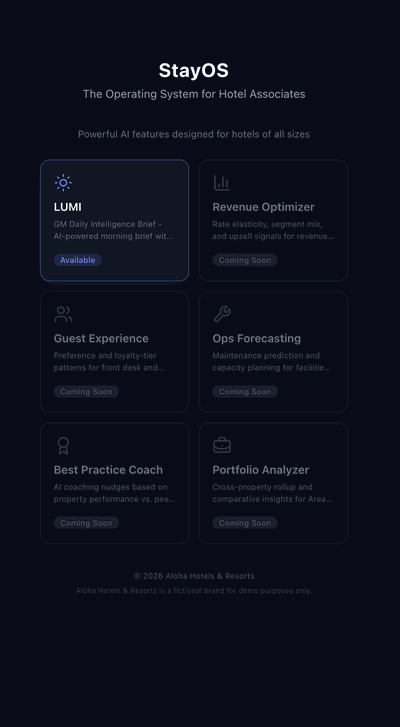
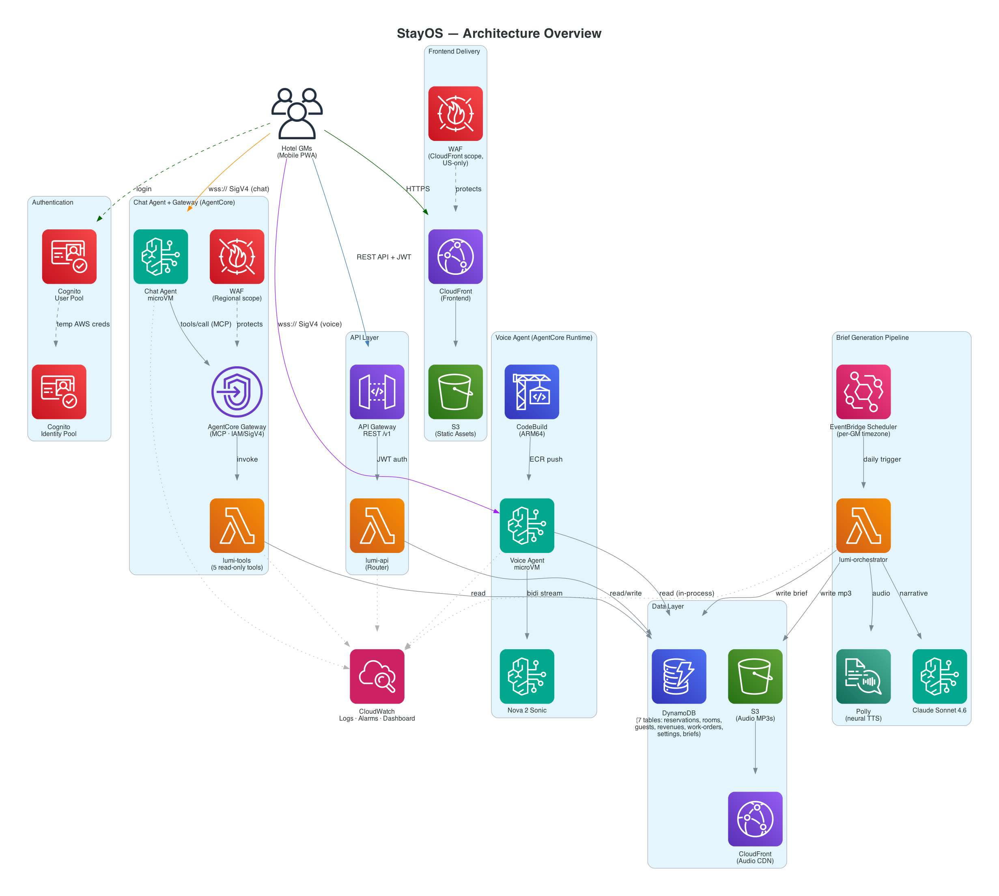

# LUMI — Daily GM Intelligence Brief (StayOS Feature #1)

LUMI is the first feature of [StayOS](../README.md) — the General Manager's
daily intelligence brief. It is not a separate product; GMs use LUMI, which
runs on the shared StayOS platform. At each GM's configured delivery time,
LUMI pulls data from upstream systems, generates a personalized AI summary,
and delivers it as both a visual dashboard and a 60-90 second audio brief —
ready to consume during a property walk-through, not chained to a workstation.

> [!NOTE]
> This is a prototype and customer demo — not a production deployment. It demonstrates the architecture for StayOS using real AWS services with mock operational data.

## Demo Screen shots

<p align="center">
  
</p>

## Table of Contents
1. [Why This Exists](#why-this-exists)
2. [What GMs Get from LUMI](#what-gms-get-from-lumi)
3. [Architecture Overview](#architecture-overview)
4. [Pilot Properties](#pilot-properties)
5. [Deployment](#deployment)
6. [Voice Agent (AgentCore)](#voice-agent-agentcore)
7. [Chat Agent (AgentCore + Gateway)](#chat-agent-agentcore--gateway)
8. [Data Sources](#data-sources)
9. [Tech Stack](#tech-stack)
10. [References](#references)

## Why This Exists

Hotel General Managers spend their first 30-45 minutes every morning logging into 4-6 separate systems (PMS, Revenue Management, Loyalty/CRM, Facilities) to manually assemble a picture of the day. VIP arrivals are discovered reactively at the front desk. Overbooking situations surface during check-in rush. Revenue opportunities are missed because insights come too late. LUMI eliminates that fragmented morning ritual — see the [StayOS root README](../README.md) for how this feature fits into the broader platform.

## What GMs Get from LUMI

- **Daily KPI Dashboard** — Occupancy, ADR, RevPAR with directional indicators (vs. last week, vs. budget, vs. YOY)
- **VIP Arrival Alerts** — Loyalty tier, stay count, preferences, special occasions — proactively briefed before check-in
- **Overbooking Early Warning** — Overage count + walk strategy recommendation at 6 AM, not during check-in rush
- **Rooms Out of Order** — Premium-flagged OOO rooms with work order status, hours open, and tap-to-view detail modal
- **Upsell Opportunities** — Eligible arrivals, potential revenue, front desk briefing recommendations
- **AI Audio Brief** — 60-90 second personalized summary in 4 languages (EN, ES, JA, ZH), playable during property walk
- **Voice Agent** — Conversational Q&A over the shared dataset via push-to-talk WebSocket (Nova Sonic)
- **Chat Agent** — Text-based conversational Q&A over the same dataset for when voice isn't practical (noisy lobby, meetings), backed by Claude Sonnet via an AgentCore Gateway MCP endpoint
- **Brief History** — Past 30 days of briefs accessible via carousel

## Architecture Overview



> **StayOS hosting + SSO:** LUMI is served at **`/lumi`** on the shared StayOS
> CloudFront distribution and consumes the shared `@stayos/auth` module — one
> login at the shell (`/`) opens LUMI with no second sign-in. See the
> [root README](../README.md) and [`stayos-shell/README.md`](../stayos-shell/README.md)
> for the shell/SSO details; `/lumi/login` is a deep-link fallback only.

Deployed in a single AWS region (us-east-1) using a serverless & managed architecture:

| Layer | Service | Purpose |
|-------|---------|---------|
| Frontend | CloudFront + S3 | Static Next.js PWA served via CDN with OAC, at `/lumi` on the shared StayOS distribution |
| API | API Gateway + Lambda | REST API with Cognito JWT authorization |
| Audio | Amazon Polly | Multi-language text-to-speech (neural voices) |
| Voice Agent| Bedrock AgentCore Runtime | WebSocket voice agent (Nova Sonic STT/TTS) via managed microVMs, calls tools in-process |
| Chat Agent | Bedrock AgentCore Runtime + Gateway | WebSocket text agent (Claude Sonnet + Strands Agent) discovering/calling tools via MCP over the AgentCore Gateway |
| Gateway Tools | Bedrock AgentCore Gateway + Lambda | 5 read-only hotel-ops tools exposed as an MCP Lambda target, shared source of truth for chat (and future agents) |
| Data | DynamoDB | GM settings, generated briefs, and 5 operational dataset tables |
| Storage | S3 + CloudFront | Polly-generated MP3 audio with CDN delivery |
| Auth | Amazon Cognito + shared `@stayos/auth` | Admin-provisioned GM accounts with JWT tokens; single sign-on shared with the StayOS shell and PULSE |
| Security | AWS WAF | US-only geographic restriction on API + frontend |
| Observability | CloudWatch + X-Ray | Unified logging, dashboards, alarms, distributed tracing |


## Pilot Properties

5 properties across 4 regions with pre-provisioned GM accounts in Cognito:

| GM | Alias | Property ID | Location | Timezone | Language |
|----|-------|-------------|----------|----------|----------|
| Jennifer Smith | jsmith | ALOHA-CHI-001 | Chicago, IL | America/Chicago | en-US |
| Miguel Rodriguez | mrodriguez | ALOHA-MIA-001 | Miami, FL | America/New_York | en-US |
| Takeshi Tanaka | ttanaka | ALOHA-TYO-001 | Tokyo | Asia/Tokyo | ja-JP |
| Carlos Garcia | cgarcia | ALOHA-MAD-001 | Madrid, Spain | Europe/Madrid | es-ES |
| Priya Desai | pdesai | ALOHA-BOM-001 | Mumbai | Asia/Kolkata | en-US |

## Deployment

> **Deployment is driven from the repo root.** Deploy the whole platform with a
> single `make deploy-all APP_PASSWORD=...` — see the
> [root README → Deployment](../README.md#deployment) for prerequisites,
> parameters, and the full target list (`make help`).
>
> The rest of this section is LUMI-specific **reference** for the components
> `deploy-all` provisions: the voice agent, the chat agent + Gateway, their
> environment variables, and the shared data sources.

### Voice Agent (AgentCore)

The LUMI voice agent runs on [Amazon Bedrock AgentCore Runtime](https://docs.aws.amazon.com/bedrock-agentcore/latest/devguide/) - a managed service providing session-isolated microVMs, WebSocket endpoints, and scale-to-zero when idle.

#### Voice Agent Deployment

The voice agent is deployed automatically as part of the platform deploy
(`make deploy-all`, see the [root README](../README.md#deployment)). The pipeline:
1. Builds an ARM64 container image via CodeBuild (no local Docker/Finch required)
2. Pushes the image to ECR
3. Creates/updates the AgentCore Runtime via AWS CLI

#### Voice Agent Environment Variables

The agent container reads these environment variables at runtime (configured in `agentcore.yaml`):

| Variable | Description | Example |
|----------|-------------|---------|
| `RESERVATIONS_TABLE_NAME` | DynamoDB reservations table | `stayos-reservations` |
| `ROOMS_TABLE_NAME` | DynamoDB rooms table | `stayos-rooms` |
| `GUESTS_TABLE_NAME` | DynamoDB guests table | `stayos-guests` |
| `REVENUES_TABLE_NAME` | DynamoDB revenues table | `stayos-revenues` |
| `WORK_ORDERS_TABLE_NAME` | DynamoDB work orders table | `stayos-work-orders` |
| `SETTINGS_TABLE_NAME` | DynamoDB GM settings table | `stayos-settings` |
| `AWS_DEFAULT_REGION` | AWS region for boto3 clients | `us-east-1` |

#### Frontend Environment Variables

The frontend needs these environment variables (set in `.env.local` or build environment):

| Variable | Description | Source |
|----------|-------------|--------|
| `NEXT_PUBLIC_AGENTCORE_RUNTIME_ARN` | AgentCore Runtime ARN for WebSocket endpoint | Written by `make voice-deploy` to `.voice-runtime-id` |
| `NEXT_PUBLIC_COGNITO_IDENTITY_POOL_ID` | Identity Pool ID for credential exchange | CloudFormation output: `VoiceIdentityPoolId` |
| `NEXT_PUBLIC_AWS_REGION` | AWS region | `us-east-1` |

#### Authentication Flow

The voice agent uses SigV4 authentication via Cognito Identity Pool (replacing the previous JWT-in-URL pattern):

1. **Credential exchange** - The browser exchanges the Cognito ID Token for temporary AWS credentials via the Identity Pool
2. **SigV4 WebSocket** - Temporary credentials sign a presigned WebSocket URL for the AgentCore endpoint
3. **Identity verification** - The Access Token is sent as the first message; the container calls `cognito-idp:GetUser` to extract the GM's `propertyId` and `gmAlias`
4. **Voice session** - Standard bidirectional audio streaming via Nova Sonic (same protocol as before)


## Chat Agent (AgentCore + Gateway)

The LUMI chat agent runs on the same [Amazon Bedrock AgentCore Runtime](https://docs.aws.amazon.com/bedrock-agentcore/latest/devguide/) as the voice agent, but answers General Manager questions as text instead of speech — useful when voice isn't practical (a noisy lobby, a meeting, or simply a preference for typing). It uses [Strands Agents](https://strandsagents.com/) with Claude Sonnet for reasoning, and discovers/calls tools through the **AgentCore Gateway** rather than in-process.

#### Why a Gateway instead of calling tools directly?

The voice agent calls its 5 DynamoDB-query tools directly, in-process, for the lowest possible latency during a live audio session. The chat agent instead connects to an **AgentCore Gateway**, which exposes those same 5 tools as a standard MCP (Model Context Protocol) endpoint backed by a Lambda function (`stayos-tools`). This means:

- The tool implementation lives in exactly one place (`backend/functions/tools/lambda_function.py`), reusing the same DynamoDB access patterns as the voice agent's `tool_handlers.py`
- New tools registered on the Gateway are picked up by the chat agent automatically, with no redeploy
- Future agents (or future write tools) can reuse the same Gateway without duplicating tool logic
- The Gateway is protected by a dedicated regional AWS WAFv2 WebACL (managed rule groups + rate limiting) in front of the Lambda target

```
Browser              AgentCore Gateway           Tool Lambda          DynamoDB
   |                        |                         |                  |
   |-- WebSocket (SigV4) -->|                         |                  |
   |   Chat Agent (Strands) |                         |                  |
   |     tools/list ------->|                         |                  |
   |<-- 5 tool specs -------|                         |                  |
   |     tools/call ------->|-- invoke (SigV4) ------>|                  |
   |                        |   flat event +          |-- GetItem/Query->|
   |                        |   client_context.custom  |<-----------------|
   |                        |<-- {status, data} -------|                  |
   |<-- streamed response --|                         |                  |
```

#### Chat Agent Deployment

The chat agent is deployed automatically as part of the platform deploy
(`make deploy-all`), after the Gateway is registered so the Gateway endpoint URL
is available. The pipeline mirrors the voice agent:
1. Builds an ARM64 container image via CodeBuild
2. Pushes the image to ECR
3. Creates/updates the AgentCore Runtime via AWS CLI, injecting `GATEWAY_ENDPOINT_URL` (read from SSM) as an environment variable

To iterate on the chat agent or Gateway on their own (LUMI already deployed):

```bash
make gateway-deploy  # Create/update AgentCore Gateway + register Tool Lambda target + WAF
make chat-build      # Zip source → S3 → CodeBuild → ECR image
make chat-deploy     # Create/update AgentCore Runtime
make chat-destroy    # Delete the AgentCore Runtime
make gateway-destroy # Tear down the AgentCore Gateway
```

#### Chat Agent Environment Variables

| Variable | Description | Example |
|----------|-------------|---------|
| `GATEWAY_ENDPOINT_URL` | AgentCore Gateway MCP endpoint (from SSM `/stayos/gateway/endpoint-url`) | `https://stayos-gateway-xxxxx.gateway.bedrock-agentcore.us-east-1.amazonaws.com/mcp` |
| `COGNITO_USER_POOL_ID` | Cognito User Pool for identity resolution | `us-east-1_xxxxxxxxx` |
| `AWS_DEFAULT_REGION` | AWS region for boto3 clients and the Gateway SigV4 signer | `us-east-1` |

#### Frontend Chat Additions

| Component | Role |
|-----------|------|
| `AskLumiModal.tsx` | Replaces the direct mic-tap flow — presents a Voice / Chat choice from the bottom nav |
| `ChatPanel.tsx` | Full-screen chat UI: message thread rendered as Markdown (tables, bold, lists via `react-markdown` + `remark-gfm`), always-visible tappable example-question chips, typing indicator |
| `useChatAgent.ts` | WebSocket session management, SigV4 auth (same Identity Pool as voice), message streaming/accumulation |

Frontend env additions: `NEXT_PUBLIC_CHAT_RUNTIME_ARN` (written by `make write-frontend-env` from the chat runtime ID in SSM), reusing the existing `NEXT_PUBLIC_COGNITO_IDENTITY_POOL_ID`/`NEXT_PUBLIC_AWS_REGION` from the voice agent setup.

See [`docs/chat-agent-architecture.png`](docs/chat-agent-architecture.png) for the full component diagram.

## Data Sources

LUMI reads from the shared DynamoDB operational layer seeded at deploy time with
30 days of deterministic hotel operations data (the seed-data Lambda, a
CloudFormation custom resource, generates ~24,000 items across LUMI's 7
`stayos-*` tables). This same data layer is shared platform-wide — PULSE consumes
its streams. See the canonical **[Data Model Reference](docs/data-model.md)** for
complete schemas, relationships, access patterns, enumerated values, and
generation parameters for both LUMI and PULSE.


## References

- [AWS Well-Architected — Serverless Applications Lens](https://docs.aws.amazon.com/wellarchitected/latest/serverless-applications-lens/welcome.html)
- [Amazon Bedrock AgentCore — Runtime Developer Guide](https://docs.aws.amazon.com/bedrock-agentcore/latest/devguide/)
- [Amazon Bedrock AgentCore — Gateway (MCP tool targets)](https://docs.aws.amazon.com/bedrock-agentcore/latest/devguide/gateway.html)
- [Strands Agents SDK](https://strandsagents.com/)
- [Amazon Bedrock — Converse API](https://docs.aws.amazon.com/bedrock/latest/userguide/conversation-inference.html)
- [Amazon Nova Sonic — Bidirectional Streaming](https://docs.aws.amazon.com/nova/latest/userguide/speech.html)
- [Amazon Polly — Neural Voices](https://docs.aws.amazon.com/polly/latest/dg/ntts-voices-main.html)
- [DynamoDB Single-Table Design](https://docs.aws.amazon.com/amazondynamodb/latest/developerguide/bp-general-nosql-design.html)
- [Next.js 15 — App Router](https://nextjs.org/docs/app)
