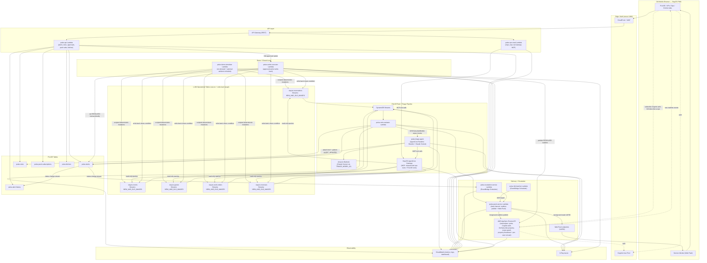

# PULSE — Architecture

> Standalone architecture diagram for **PULSE** (StayOS Feature 2): a real-time,
> tiered, AI-triaged alerting layer with a human-approved closed-loop resolution
> path. This diagram is the canonical system view from
> [`../.kiro/specs/initial-pulse-project/design.md`](../.kiro/specs/initial-pulse-project/design.md)
> and is kept in sync with it. A rendered `architecture.png` sits alongside this
> file (mirroring LUMI's `lumi/docs/architecture.png` convention).

PULSE reuses LUMI's platform primitives — the shared PWA shell, the Cognito user
pool, the AWS WAF web ACL, the DynamoDB operational tables (now with Streams
enabled), and the shared StayOS AgentCore Gateway tool layer — and adds an
event-driven Rule Engine, an agentic Triage Agent, a dual-channel delivery layer
(AppSync Events realtime + Web Push background wake), and a closed-loop Action
Executor that writes approved resolutions back to the operational tables.

## System diagram



## The closed loop

```
operational data change  ->  Stream  ->  Rule Engine  ->  Alert + Triage
        ^                                                     |
        |                                                     v
   Action Executor  <--  GM approves ranked option  <--  Push to GM
   (write-back)
        |
        +-->  operational data change clears the condition  ->  Stream
                                                                 |
                                                                 v
                                          Rule Engine re-evaluates -> originating alert -> RESOLVED
```

A change in operational data is picked up, triaged by the agent, the GM approves
a resolving action, and that action **writes back** to the operational data. The
write-back flows through Streams like any other change; the Rule Engine
re-evaluates, sees the triggering condition no longer holds, and transitions the
**originating** alert to RESOLVED (correlated by `sourceEntityRef` / `dedupeKey`)
rather than emitting a new one.

## Legend

- **Reused from LUMI (shared StayOS platform):** CloudFront + WAF, Cognito user
  pool, the five `lumi-*` operational tables, and the StayOS AgentCore Gateway
  tool layer.
- **New in PULSE:** the Rule Engine (`pulse-rule-evaluator`), the agentic Triage
  Agent (AgentCore Runtime), the dual-channel delivery layer (AppSync Events +
  Web Push), the Escalation Service, and the closed-loop Demo Simulator +
  Action Executor.
- **Solid arrows** = data/control flow; **dotted arrows** = auth and realtime
  WebSocket (AppSync Events) paths.

For the full requirement/property mapping and design decisions, see
[`../.kiro/specs/initial-pulse-project/design.md`](../.kiro/specs/initial-pulse-project/design.md).
